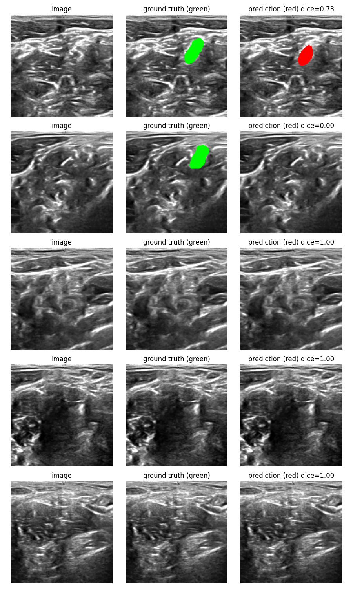

# Ultrasound Nerve Segmentation

Binary segmentation of nerve structures in ultrasound images using a U-Net
with a ResNet34 encoder.

## Problem

Given an ultrasound image, predict a pixel-level mask of the nerve region.
Accurate automatic segmentation reduces the manual annotation burden in
procedures like nerve-block placement.

## Dataset

[Kaggle Ultrasound Nerve Segmentation](https://www.kaggle.com/c/ultrasound-nerve-segmentation) —
grayscale ultrasound images paired with binary nerve masks.

## Architecture

U-Net (via [segmentation_models_pytorch](https://github.com/qubvel/segmentation_models.pytorch))
with a ResNet34 encoder pretrained on ImageNet. Input images are resized to
128x128 and expanded to 3 channels to match the pretrained encoder. Skip
connections between encoder and decoder preserve fine boundary detail lost
during downsampling.

## Training

- Loss: combined Dice + BCE (`src/loss.py`) — BCE stabilizes per-pixel
  gradients, Dice directly optimizes mask overlap.
- Optimizer: Adam, lr=1e-3
- Epochs: 30
- Augmentation: horizontal flip, brightness/contrast jitter, ImageNet
  normalization (`src/dataset.py`)
- Checkpointing: best model saved by validation Dice (`src/train.py`)

## Results

| Metric        | Value  |
|---------------|--------|
| Val Dice      | 0.6603 |

Best checkpoint from epoch 11/30; val Dice oscillated in the 0.62-0.66 range
afterward while train loss kept falling, indicating mild overfitting past
that point.



## How to run

```bash
pip install -r requirements.txt
python src/train.py --data-dir data/ultrasound-nerve-segmentation --epochs 30
```

Data is expected in the Kaggle layout: `<data-dir>/image/{id}_{n}.tif` paired
with `<data-dir>/mask/{id}_{n}_mask.tif`.

Generate side-by-side prediction visualizations:

```python
from src.visualize import plot_predictions
plot_predictions(model, val_dataset, n=5, device="cuda")
```

## Project structure

```
src/
  dataset.py    NerveDataset + Albumentations pipelines
  loss.py       DiceBCELoss
  metrics.py    dice_score, iou_score
  train.py      training loop with best-checkpoint saving
  visualize.py  plot_predictions for image/GT/prediction comparisons
models/         saved checkpoints
data/           raw/ and processed/ image-mask pairs
```
